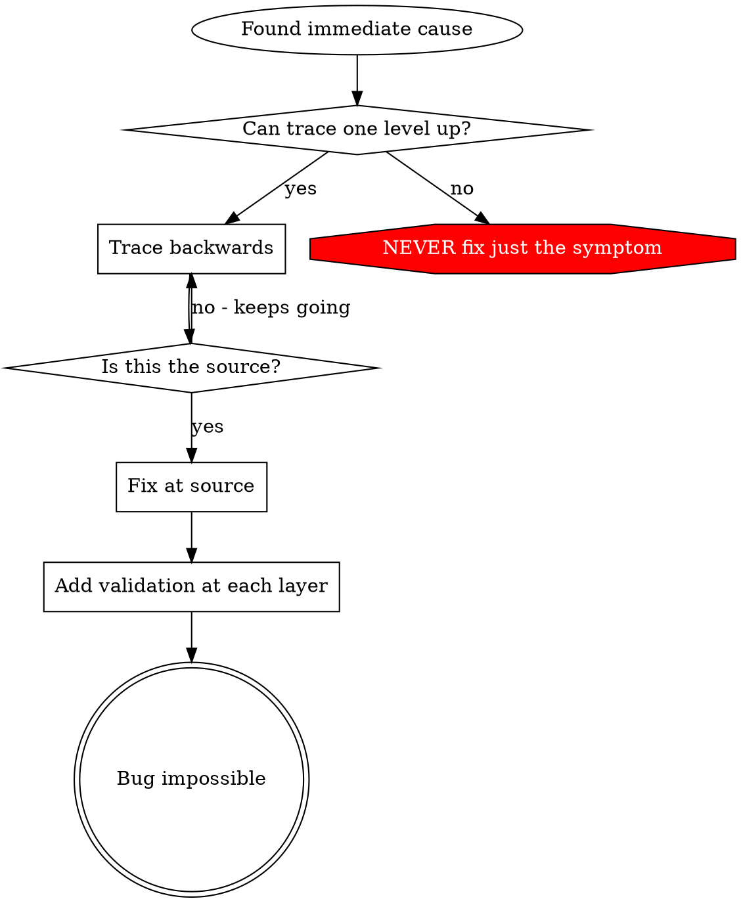

# Root Cause Tracing

## Overview

Bugs often manifest deep in the call stack (git init in wrong directory, file created in wrong location, database opened with wrong path). Your instinct is to fix where the error appears, but that's treating a symptom.

**Core principle:** Trace backward through the call chain until you find the original trigger, then fix at the source.

**Use when:**
- Error happens deep in execution (not at entry point)
- Stack trace shows long call chain
- Unclear where invalid data originated
- Need to find which test/code triggers the problem

## Contents

1. The tracing process
2. Adding stack traces
3. Finding which test causes pollution
4. Key principle

## The Tracing Process

### 1. Observe the Symptom
```
Error: git init failed in /path/to/project/packages/core
```

### 2. Find Immediate Cause
**What code directly causes this?**
```typescript
await execFileAsync('git', ['init'], { cwd: projectDir });
```

### 3. Ask: What Called This?
```typescript
WorktreeManager.createSessionWorktree(projectDir, sessionId)
  → called by Session.initializeWorkspace()
  → called by Session.create()
  → called by test at Project.create()
```

### 4. Keep Tracing Up
**What value was passed?**
- `projectDir = ''` (empty string!)
- Empty string as `cwd` resolves to `process.cwd()`
- That's the source code directory!

### 5. Find Original Trigger
**Where did empty string come from?**
```typescript
const context = setupCoreTest(); // Returns { tempDir: '' }
Project.create('name', context.tempDir); // Accessed before beforeEach!
```

**Fix at the source:** here, make `tempDir` a getter that throws if accessed before `beforeEach` — then harden the layers the bad value passed through (see `defence-in-depth.md`).

## Adding Stack Traces

When you can't trace manually, add instrumentation:

```typescript
// Before the problematic operation
async function gitInit(directory: string) {
  const stack = new Error().stack;
  console.error('DEBUG git init:', {
    directory,
    cwd: process.cwd(),
    nodeEnv: process.env.NODE_ENV,
    stack,
  });

  await execFileAsync('git', ['init'], { cwd: directory });
}
```

**Critical:** Use `console.error()` in tests (not logger - may not show), and log **before** the dangerous operation, not after it fails.

**Run and capture:**
```bash
npm test 2>&1 | grep 'DEBUG git init'
```

**Analyse stack traces:**
- Look for test file names
- Find the line number triggering the call
- Identify the pattern (same test? same parameter?)

## Finding Which Test Causes Pollution

If something appears during tests but you don't know which test, use a bisection approach — run tests one-by-one or in halving groups to isolate the polluter:

```bash
# Run tests individually to find which one creates the artefact
for f in src/**/*.test.ts; do
  npx vitest run "$f" 2>/dev/null
  if [ -e '.git' ]; then echo "POLLUTER: $f"; break; fi
done
```

## Key Principle



**NEVER fix just where the error appears.** Trace back to find the original trigger.
